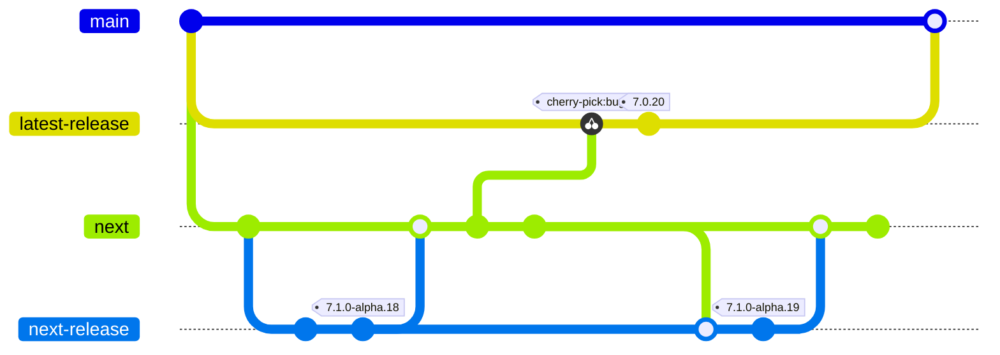
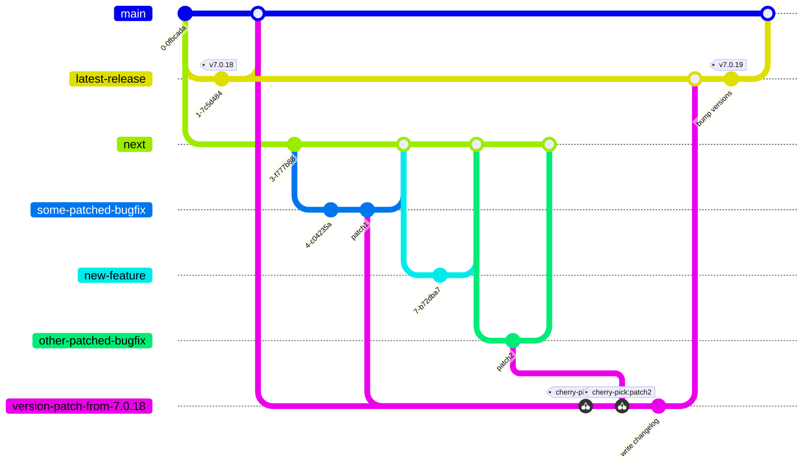
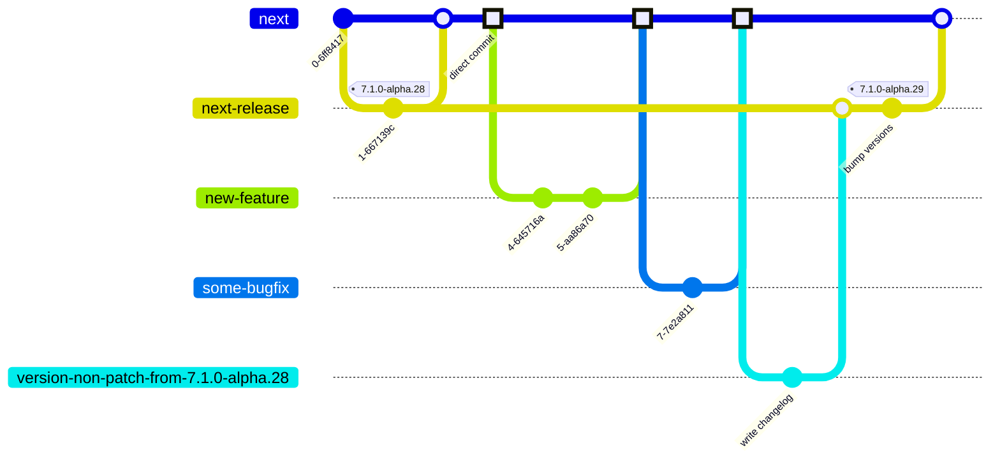
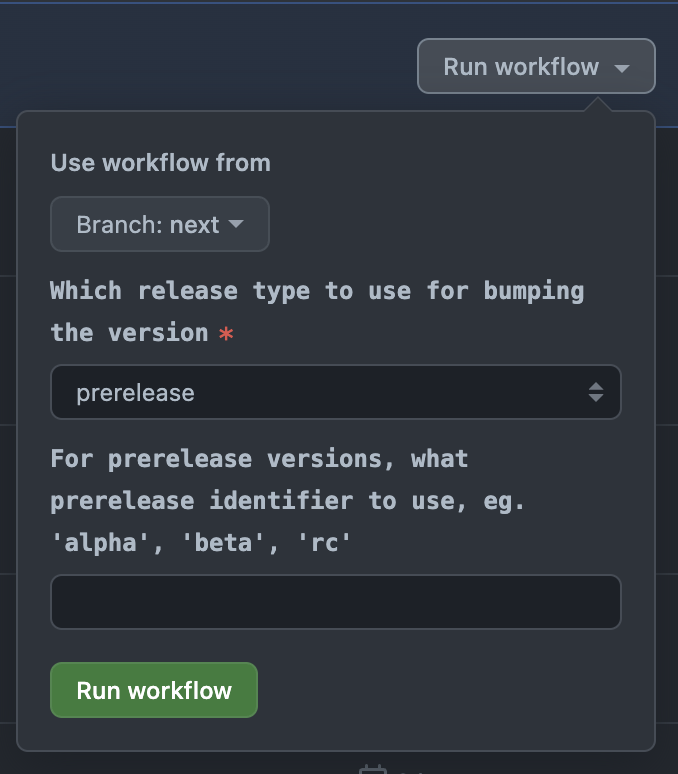
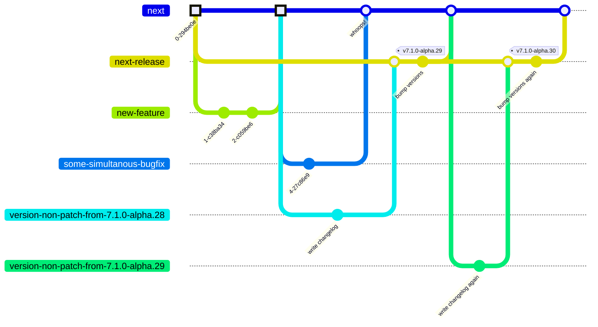

# Releasing <!-- omit in toc -->

> **Note**
> This document is relevant only for maintainers that have permissions to release new versions of Storybook. Anyone can read it for interest or to suggest changes, but it's not required knowledge.

## Table of Contents <!-- omit in toc -->

- [Introduction](#introduction)
  - [Branches](#branches)
- [Release Pull Requests](#release-pull-requests)
  - [Patch Releases](#patch-releases)
  - [Non-patch Releases](#non-patch-releases)
  - [Publishing](#publishing)
- [👉 How to Release](#-how-to-release)
  - [1. Find the Prepared Pull Request](#1-find-the-prepared-pull-request)
  - [2. Freeze the Pull Request and run CI](#2-freeze-the-pull-request-and-run-ci)
  - [3. QA Each Merged Pull Request](#3-qa-each-merged-pull-request)
  - [4. Re-trigger the Workflow](#4-re-trigger-the-workflow)
  - [5. Make Manual Changes](#5-make-manual-changes)
  - [6. Merge](#6-merge)
  - [7. See the "Publish" Workflow Finish](#7-see-the-publish-workflow-finish)
- [Releasing Locally in an Emergency 🚨](#releasing-locally-in-an-emergency-)
- [Canary Releases](#canary-releases)
  - [With GitHub UI](#with-github-ui)
  - [With the CLI](#with-the-cli)
- [Versioning Scenarios](#versioning-scenarios)
  - [Prereleases - `7.1.0-alpha.12` -\> `7.1.0-alpha.13`](#prereleases---710-alpha12---710-alpha13)
  - [Prerelease promotions - `7.1.0-alpha.13` -\> `7.1.0-beta.0`](#prerelease-promotions---710-alpha13---710-beta0)
  - [Minor/major releases - `7.1.0-rc.2` -\> `7.1.0` or `8.0.0-rc.3` -\> `8.0.0`](#minormajor-releases---710-rc2---710-or-800-rc3---800)
  - [First prerelease of new major/minor - `7.1.0` -\> `7.2.0-alpha.0` or `8.0.0-alpha.0`](#first-prerelease-of-new-majorminor---710---720-alpha0-or-800-alpha0)
  - [Patch releases to stable - subset of `7.1.0-alpha.13` -\> `7.0.14`](#patch-releases-to-stable---subset-of-710-alpha13---7014)
  - [Patch releases to earlier versions - subset of `7.1.0-alpha.13` -\> `6.5.14`](#patch-releases-to-earlier-versions---subset-of-710-alpha13---6514)
  - [Prerelease of upcoming patch release - `7.0.20` -\> `7.0.21-alpha.0`](#prerelease-of-upcoming-patch-release---7020---7021-alpha0)
  - [Merges to `main` without versioning](#merges-to-main-without-versioning)
- [FAQ](#faq)
  - [When should I use the "patch:yes" label?](#when-should-i-use-the-patchyes-label)
  - [How do I make changes to the release tooling/process?](#how-do-i-make-changes-to-the-release-toolingprocess)
  - [Why do I need to re-trigger workflows to update the changelog?](#why-do-i-need-to-re-trigger-workflows-to-update-the-changelog)
  - [Which combination of inputs creates the version bump I need?](#which-combination-of-inputs-creates-the-version-bump-i-need)
  - [Which changes are considered "releasable", and what does it mean?](#which-changes-are-considered-releasable-and-what-does-it-mean)
  - [Why are no release PRs being prepared?](#why-are-no-release-prs-being-prepared)
  - [Why do we need separate release branches?](#why-do-we-need-separate-release-branches)

## Introduction

This document explains the release process for the Storybook monorepo. There are two types:

1. Non-patch releases - releasing any content that is on the `next` branch, either prereleases or stable releases
2. Patch releases - picking any content from `next` to `main`, that needs to be patched back to the current stable minor release

The release process is based on automatically created "Release Pull Requests", that when merged will trigger a new version to be released.

A designated Releaser -- which may rotate between core team members -- will go through the release process in the current Release PR. This process is implemented with NodeJS scripts in [`scripts/release`](../scripts/release/) and three GitHub Actions workflows:

- [Prepare `next` PR](../.github/workflows/prepare-non-patch-release.yml)
- [Prepare patch PR](../.github/workflows/prepare-patch-release.yml)
- [Publish](../.github/workflows/publish.yml)

> **Note**
> This document distinguishes between **patch** and **non-patch** releases. The distinction reflects the difference between patching an existing minor version on `main` or releasing a new minor/major/prerelease from `next`.

### Branches

To understand the release structure, it's important to know the branching strategy used. All development is done on the `next` branch, where new features and bug fixes are added. This branch contains content to be released in the next prerelease (eg. `v7.1.0-alpha.22`).

The `main` branch contains the content for the current stable release (eg. `v7.0.20`). When changes need to be made to both the next major/minor release and the current patch release (bug fixes or small improvements), they are made to `next`. If the change needs to be patched back to the current minor version (eg. from `7.1.0-alpha.20` to `7.0.18`), the PR containing the fix is labeled with the **"patch"** label, so the release workflow can pick it up. This ensures changes are tested in a prerelease before being released to stable.

The actual (pre)releases are not made from `next` nor `main`, but from `next-release` and `latest-release` respectively. This indirection is explained in [the "Why do we need separate release branches?" section](#why-do-we-need-separate-release-branches) below.

The branches in the monorepo can be summarized in this diagram (simplified):



## Release Pull Requests

Two GitHub Actions workflows automatically create release pull requests, one for each type of release. These pull requests act as the "interface" for the Releaser to create a new release. Although the behavior between the two is similar, some minor differences exist, as described in the subsections below.

The high-level flow is:

1. When a PR is merged to `next` (or a commit is pushed), both release pull requests are (re)generated.
2. They create a new branch - `version-(patch|non-patch)-from-<CURRENT-VERSION>`.
3. They calculate which version to bump to according to the version strategy.
4. They update `CHANGELOG(.prerelease).md` with all changes detected.
5. They commit everything.
6. They **force push**.
7. They open/edit a pull request towards `next-release` or `latest-release`.

A few key points to note in this flow:

- The PRs are regenerated on any changes to `next`, or can be manually triggered (see [the Re-trigger the Workflow section](#4-re-trigger-the-workflow)).
- The changes are force pushed to the branch, so any manual changes on the release branch before merging risk being overwritten if someone else merges a new change to `next`, triggering the workflow. To avoid this, apply the **"freeze"** label to the pull request.
- The changelogs are committed during the preparation, but the packages are not version bumped and not published until later.
- The release pull requests don't target their working branches (`next` and `main`), but rather `next-release` and `latest-release`.

### Patch Releases

> **Note**
> Workflow: [`prepare-patch-release.yml`](../.github/workflows/prepare-patch-release.yml)

Patch releases are created by [cherry-picking](https://www.atlassian.com/git/tutorials/cherry-pick) any merged, unreleased pull requests that have the "**patch:yes**" label applied to the `next` branch. The merge commit of said pull requests are cherry-picked.

Sometimes it is desired to pick pull requests back to `main` even if they are not considered "releasable". Unlike non-patch release preparation, patch releases will not be canceled if the content is not releasable. It might not make sense to create a new patch release if the changes are only for documentation and/or internal build systems. However, getting the changes back to `main` is the only way to deploy the documentation to the production docs site. You may also want to cherry-pick changes to internal CI to fix issues. These are valid scenarios where you want to cherry-pick the changes without being blocked on "releasable" content. In these cases, where all cherry picks are non-releasable, the preparation workflow creates a "merging" pull request instead of a "releasing" pull request. This pull request does not bump versions or update changelogs; it just cherry-picks the changes and allows you to merge them into `latest-release` -> `main`.

The preparation workflow sequentially cherry-picks each patch pull request to its branch. If this cherry-picking fails due to conflicts or other reasons, it is ignored and the next pull request is processed. All failing cherry-picks are listed in the release pull request's description, for the Releaser to manually cherry-pick during the release process. This problem occurs more often when `main` and `next` diverge, i.e. the longer it has been since a stable major/minor release.

Similar to the non-patch release flow, the preparation workflow for patches will create a new branch from `main` called `version-patch-from-<CURRENT-STABLE-VERSION>`, and open a pull request that targets `latest-release`. When the pull request is merged by the Releaser, the [publish workflow](#publishing) will eventually merge `latest-release` into `main`.

Here is an example of a workflow where a feature and two bug fixes have been merged to `next`. Only the bug fixes have the "**patch:yes**" label, so only those two go into the new `7.0.19` release. Note that it is the merge commits to `next` that are cherry-picked, not the commits on the bugfix branches.



### Non-patch Releases

> **Note**
> Workflow: [`prepare-non-patch-release.yml`](../.github/workflows/prepare-non-patch-release.yml)

Non-patch releases are prepared with all content from the `next` branch. The changelog is generated by examining the git history, and looking up all the commits and pull requests between the current prerelease (on `next-release`) and `HEAD` of `next`.

The default versioning strategy is to increase the current prerelease number, as described in [Prereleases - `7.1.0-alpha.12` -> `7.1.0-alpha.13`](#prereleases---710-alpha12---710-alpha13). If there is no prerelease number (i.e., we just released a new stable minor/major version), it will add one to a patch bump, so it would go from `7.2.0` to `7.2.1-0` by default.

`next`-PRs are only created if there are actual changes to release. Content labeled with "build" or "documentation" is [not considered "releasable"](#which-changes-are-considered-releasable-and-what-does-it-mean) and is not user-facing, so it doesn't make sense to create a release. This is explained in more detail in [Why are no release PRs being prepared?](#why-are-no-release-prs-being-prepared).

The preparation workflow will create a new branch from `next`, called `version-non-patch-from-<CURRENT-NEXT-VERSION>`, and open a pull request targeting `next-release`. When the Releaser merges it, the [publish workflow](#publishing) will merge `next-release` into `next`.

Here's an example of a workflow where a feature and a bugfix have been created and then released to a new `7.1.0-alpha.29` version. All the commits highlighted with square dots are the ones that will be considered when generating the changelog.



### Publishing

> **Note**
> Workflow: [`publish.yml`](../.github/workflows/publish.yml)

When either a non-patch release or a patch release branch is merged into `latest-release` or `next-release`, the publishing workflow is triggered. This workflow performs the following tasks:

1. Bump versions of all packages according to the plan from the prepared PRs
2. Install dependencies and build all packages.
3. Publish packages to npm.
4. (If this is a patch release, add the "**patch:done**" label to all relevant pull requests.)
5. Create a new GitHub Release, including a version tag in the release branch (`latest-release` or `next-release`).
6. Merge the release branch into the core branch (`main` or `next`).
7. (If this is a patch release, copy the `CHANGELOG.md` changes from `main` to `next`.)

The publish workflow runs in the "release" GitHub environment, which has the npm token required to publish packages to the `@storybook` npm organization. For security reasons, this environment can only be accessed from the four "core" branches: `main`, `next`, `latest-release` and `next-release`.

## 👉 How to Release

This section explains what a Releaser should do when it's time to release. The steps are also outlined in the release pull requests, to provide guidance for inexperienced Releasers.

The high-level workflow for a Releaser is:

1. Find the prepared pull request
2. Freeze the pull request
3. Make changes to merged pull requests (revert, rename, relabel)
4. Re-trigger the workflow to get changes from step 3 in
5. Make any manual changes needed
6. Merge
7. Check that the "publish" workflow has finished successfully

### 1. Find the Prepared Pull Request

Look for the release pull request that has been prepared for the type of release you're about to release:

- "Release: Prerelease|Minor|Major `<NEXT-VERSION>`" for releases from `next`
- "Release: Patch `<NEXT-VERSION>`" for patch releases
- "Release: Merge patches to `main` (without version bump)" for patches without releases

For example: https://github.com/storybookjs/storybook/pull/23148

### 2. Freeze the Pull Request and run CI

Add the "**freeze**" label to the pull request. This will stop the preparation workflows from running when new changes to `next` are merged. This allows you to make changes without worrying about other people's work overriding yours.

The "**freeze**" label does not cancel the workflows when they are triggered manually, so you can still run the workflow.

You also need to add the "**ci:daily**" label to the pull request to trigger CI runs. This will start a full CI run and re-run on any changes. CI does not run by default to avoid unnecessary re-runs until a new release is being created.

### 3. QA Each Merged Pull Request

It is important to verify that the release includes the right content. Key elements to account for are:

1. Is the change suitable for the version bump?

For example, check if it's a breaking change that isn't allowed in a minor prerelease, or if it's a new feature in a patch release. If it's not suitable, revert the pull request and notify the author.

Sometimes when doing a patch release, a pull request can have the "patch:yes" label but you don't want that change to be part of this release. Maybe you're not confident in the change, or you require more input from maintainers before releasing it. In those situations you should remove the "patch:yes" label from the pull request and follow through with the release (make sure to re-trigger the workflow). When the release is done, add the "patch:yes" label back again, so it will be part of the next release.

2. Is the pull request title correct?

The title of pull requests is added to the user-facing changelogs, so it must be accurate and understandable. It should follow the pattern "[Area]: [Summary]", where [Area] is the part of the repo that has been changed, and the summary is what has changed.

It's easy to confuse [Area] with labels, but they are not the same. For example, the "**build**" label indicates that the changes are internal, but a "build" [Area] is _not_ correct. The area could be "Core" or "CI", but rarely is the area being changed actually the "build" area.
If a pull request changes multiple places, it can be hard to choose an area - this is often the case when upgrading dependencies - so use your best judgement. There's no hard rule, but a good guideline is that the more precise it is, the more useful it is to read later.

3. Is the pull request labeled correctly?

Some labels have specific meanings when it comes to releases. It's important that each pull request has labels that accurately describe the change, as labels can determine if a pull request is included in the changelog or not. This is explained further in the [Which changes are considered "releasable", and what does it mean?](#which-changes-are-considered-releasable-and-what-does-it-mean) section.

4. Patches: has it already been released in a prerelease?

If this is a patch release, make sure that all pull requests have already been released in a prerelease. If some haven't, create a new prerelease first.

This is not a technical requirement, but it's a good practice to ensure that a change doesn't break a prerelease before releasing it to stable.

### 4. Re-trigger the Workflow

Any changes made to pull requests' titles, labels or even reverts won't be reflected in the release pull request because it's hopefully frozen at this point. Even if it isn't, the workflow only triggers on pushes to `next`, not when pull request meta data is changed.

Therefore, if any changes were made in step 3, you need to re-trigger the workflow manually to regenerate the changelog and the version bump. If no changes were made, this step can be skipped.

It's important to remember that triggering the workflow will force push changes to the branch, so it must be done before committing any changes manually (the next step). Otherwise, these will be overwritten.

> **Warning**
> When re-triggering the workflow, any new content merged to `next` will also become part of the release pull request. You can't assume the same content with fixes will be seen, as new content may have been merged in since the pull request was frozen.

When triggering the workflows, always choose the `next` branch as the base, unless you know exactly what you are doing.

The workflows can be triggered here:

- [Prepare next PR](https://github.com/storybookjs/storybook/actions/workflows/prepare-non-patch-release.yml)
- [Prepare patch PR](https://github.com/storybookjs/storybook/actions/workflows/prepare-patch-release.yml)

Crucially for prereleases, this is also where you change the versioning strategy if you need something else than the default as described in [Preparing - Non-patch Releases](#non-patch-releases). When triggering the non-patch workflow manually, you can optionally add inputs:



See [Versioning Scenarios](#versioning-scenarios) for a description of each version bump scenario, how to activate it and what it does, and [Which combination of inputs creates the version bump I need?](#which-combination-of-inputs-creates-the-version-bump-i-need) for a detailed description of the workflow inputs.

### 5. Make Manual Changes

It's possible and valid to push manual changes directly on the release branch when needed. This could be to alter the changelog in a way that can't be done automatically, or another critical change is needed for the release to work. Any changes made will be merged to `next|main` once the release has been published.

It's recommended to use the automated process as much as possible to ensure that the information in GitHub is the single source of truth, and that pull requests and changelogs are in sync.

> **Warning**
> If you make manual changes to the changelog, you also need to make those changes in either [`./docs/versions/latest.json`](../docs/versions/latest.json) or [`./docs/versions/next.json`](../docs/versions/next.json). The `"plain"` property should match the changelog entry, **without the heading** and with all new lines replaces with `\n`.
> This is common for custom release notes when releasing majors and minors.

### 6. Merge

When the pull request was frozen, a CI run was triggered on the branch. If it's green, it's time to merge the pull request. If CI is failing for some reason, consult with the rest of the core team. These release pull requests are almost exact copies of `next|main` so CI should only fail if they fail too.

### 7. See the "Publish" Workflow Finish

Merging the pull request will trigger [the publish workflow](https://github.com/storybookjs/storybook/actions/workflows/publish.yml), which does the final version bumping and publishing. As a Releaser, you're responsible for this to finish successfully, so you should watch it until the end. If it fails, it will notify in Discord, so you can monitor that instead if you want to.

Done! 🚀

## Releasing Locally in an Emergency 🚨

Things can fail, code can break, and bugs can exist. When automation is broken, there may be a need for an emergency escape hatch to release new fixes. In such a situation, it's valid to run the whole release process locally instead of relying on pull requests and workflows. You don't need to create pull requests or split preparation and publishing; you can do it all at once, but make sure you still follow the correct branching strategy.

You can either prepare the release locally and use the automatic workflow for publishing it or you can do the whole release workflow locally. If you choose the latter approach, you need a token to the npm registry to publish (set as `YARN_NPM_AUTH_TOKEN`), which you can get from @shilman or @ndelangen.

You can inspect the workflows to see what they are running and copy that, but here is a general sequence of steps to mimic the automated workflow. Feel free to deviate from this as needed.

Before you start you should make sure that your working tree is clean and the repository is in a clean state by running `git clean -xdf`.

1. Create a new branch from either `next` or `main` (patches)
2. Get all tags: `git fetch --tags origin`
3. Install dependencies: `yarn task --task=install --start-from=install`
4. `cd scripts`
5. (If patch release) Cherry pick:
   1. `yarn release:pick-patches`
   2. Manually cherry pick any necessary patches based on the previous output
6. Bump versions:
   1. If you plan on using automatic publishing (ie. stop at step 12), bump with deferred: `yarn release:version --verbose --deferred --release-type <RELEASE_TYPE> --pre-id <PRE_ID>`
   2. If doing the whole release locally, **do not** defer the bump: `yarn release:version --verbose --release-type <RELEASE_TYPE> --pre-id <PRE_ID>`
7. To see a list of changes (for your own to-do list), run `yarn release:generate-pr-description --current-version <CURRENT_VERSION> --next-version <NEXT_VERSION_FROM_PREVIOUS_STEP> --verbose`
8. Write changelogs: `yarn release:write-changelog <NEXT_VERSION_FROM_PREVIOUS_STEP> --verbose`
9. `git add .`.
10. Commit changes: `git commit -m "Bump version from <CURRENT_VERSION> to <NEXT_VERSION_FROM_PREVIOUS_STEP> MANUALLY"`
11. Merge changes to the release branch:
    1. `git checkout <"latest-release" | "next-release">`
    2. `git pull`
    3. `git merge <PREVIOUS_BRANCH>`
    4. `git push origin`
12. (If automatic publishing is still working, it should kick in now and the rest of the steps can be skipped)
13. `cd ..`
14. Publish to the registry: `YARN_NPM_AUTH_TOKEN=<NPM_TOKEN> yarn release:publish --tag <"next" OR "latest"> --verbose`
15. (If patch release) `yarn release:label-patches`
16. Manually create a GitHub Release with a tag that is the new version and the target being `latest-release` or `next-release`.
17. Merge to core branch:
    1. `git checkout <"next"|"main">`
    2. `git pull`
    3. `git merge <"next-release"|"latest-release">`
    4. `git push origin`
18. (If patch release) Sync `CHANGELOG.md` to `next` with:
    1. `git checkout next`
    2. `git pull`
    3. `git checkout origin/main ./CHANGELOG.md`
    4. `git add ./CHANGELOG.md`
    5. `git commit -m "Update CHANGELOG.md for v<NEXT_VERSION>"`
    6. `git push origin`
19. (If non-patch release) Sync `versions/next.json` from `next` to `main`
    1. `git checkout main`
    2. `git pull`
    3. `git checkout origin/next ./docs/versions/next.json`
    4. `git add ./docs/versions/next.json`
    5. `git commit -m "Update versions/next.json for v<NEXT_VERSION_FROM_PREVIOUS_STEP>"`
    6. `git push origin main`

## Canary Releases

It's possible to release any pull request as a canary release multiple times during development. This is an effective way to try out changes in standalone projects without linking projects together via package managers.

To create a canary release, a core team member (or anyone else with administrator privileges) must manually trigger the canary release workflow.

**Before creating a canary release from contributors, the core team member must ensure that the code being released is not malicious.**

Creating a canary release can either be done via GitHub's UI or the [CLI](https://cli.github.com/):

### With GitHub UI

1. Open the workflow UI at https://github.com/storybookjs/storybook/actions/workflows/canary-release-pr.yml
2. On the top right corner, click "Run workflow"
3. For "branch", **always select `next`**, regardless of which branch your pull request is on
4. For the pull request number, input the number for the pull request **without a leading #**

### With the CLI

The following command will trigger a workflow run - replace `<PR_NUMBER>` with the actual pull request number:

```bash
gh workflow run --repo storybookjs/storybook canary-release-pr.yml --field pr=<PR_NUMBER>
```

When the release succeeds, it will update the "Canary release" section of the pull request with information about the release and how to use it (see example [here](https://github.com/storybookjs/storybook/pull/23508)). If it fails, it will create a comment on the pull request, tagging the triggering actor to let them know that it failed (see example [here](https://github.com/storybookjs/storybook/pull/23508#issuecomment-1642850467)).

The canary release will have the following version format: `0.0.0-pr-<PR_NUMBER>-sha-<COMMIT_SHA>`, e.g., `0.0.0-pr-23508-5ec8c1c3`. Using v0.0.0 ensures that no user will accidentally get the canary release when using a canary with prereleases, eg. `^7.2.0-alpha.0`

> ** Note **
> All canary releases are released under the same "canary" dist tag. This means you'll technically be able to install it with `npm install @storybook/cli@canary`. However, this doesn't make sense, as releases from subsequent pull requests will overwrite that tag quickly. Therefore you should always install the specific version string, e.g., `npm install @storybook/cli@0.0.0-pr-23508-sha-5ec8c1c3`.

<details>
  <summary>Isn't there a simpler/smarter way to do this?</summary>

The simple approach would be to release canaries for all pull requests automatically; however, this would be insecure as any contributor with Write privileges to the repository (200+ users) could create a malicious pull request that alters the release script to release a malicious release (e.g., release a patch version that adds a crypto miner).

To alleviate this, we only allow the "Release" GitHub environment that contains the npm token to be accessible from workflows running on the protected branches (`next`, `main`, etc.).

You could also be tempted to require approval from admins before running the workflows. However, this would spam the core team with GitHub notifications for workflow runs seeking approval - even when a core team member triggered the workflow. Therefore we are doing it the other way around, requiring contributors and maintainers to ask for a canary release to be created explicitly.

Instead of triggering the workflow manually, you could also do something smart, like trigger it when there's a specific label on the pull request or when someone writes a specific comment on the pull request. However, this would create a lot of unnecessary workflow runs because there isn't a way to filter workflow runs based on labels or comment content. The only way to achieve this would be to trigger the workflow on every comment/labeling, then cancel it if it didn't contain the expected content, which is inefficient.

</details>

## Versioning Scenarios

There are multiple types of releases that use the same principles, but are done somewhat differently.

### Prereleases - `7.1.0-alpha.12` -> `7.1.0-alpha.13`

This is the default strategy for Non-patch releases, there's nothing special needed to trigger this scenario.

### Prerelease promotions - `7.1.0-alpha.13` -> `7.1.0-beta.0`

To promote a prerelease to a new prerelease ID, during the [Re-trigger the Workflow](#4-re-trigger-the-workflow) step, choose:

- Release type: Prerelease
- Prerelease ID: The ID to promote to. For example, for alpha to beta, write "beta".

### Minor/major releases - `7.1.0-rc.2` -> `7.1.0` or `8.0.0-rc.3` -> `8.0.0`

To promote a prerelease to a stable reelase, during the [Re-trigger the Workflow](#4-re-trigger-the-workflow) step, choose:

- Release type: Patch, Minor or Major
- Prerelease ID: Leave empty

This scenario is special as it will target `latest-release` instead of `next-release`, and thus merge into `main` when done, and not `next`. So it goes `next` -> `version-non-patch-from-<CURRENT-VERSION-ON_NEXT>` -> `latest-release` -> `main`.

### First prerelease of new major/minor - `7.1.0` -> `7.2.0-alpha.0` or `8.0.0-alpha.0`

This is the first prerelease after a stable major/minor has been released. The default versioning strategy for prereleases won't work here, because it will do `7.1.0` -> `7.1.1-0`. You need to use the workflow inputs to bump the major/minor correctly:

- Release type: Premajor for `8.0.0-alpha.0` or Preminor for `7.2.0-alpha.0`
- Prerelease ID: "alpha"

### Patch releases to stable - subset of `7.1.0-alpha.13` -> `7.0.14`

This is the default patch release scenario, which cherry picks patches to `main`.

### Patch releases to earlier versions - subset of `7.1.0-alpha.13` -> `6.5.14`

This happens so rarely on a case by case basis, so this is a completely manual process. The Releaser will find the git tag that matches the patch to bump, eg. `v6.5.14`, check it out, make the necessary changes and follow [the manual release process](#releasing-locally-in-case-of-emergency-🚨).

### Prerelease of upcoming patch release - `7.0.20` -> `7.0.21-alpha.0`

In some cases, a patch change is so big and complex that it makes sense to first release it as a prerelease of the current patch stable version to see if it works, before releasing it to stable shortly thereafter.

No process is defined for this.

### Merges to `main` without versioning

As described in more details in [the Patch Releases section](#patch-releases), there are scenarios where you want to patch [unreleasable](#which-changes-are-considered-releasable-and-what-does-it-mean) content back to `main` without bumping versions or publishing a new release. This happens automatically as long as all the unpicked patch pull requests have unreleasable labels. In that case the prepared patch pull request will change form slighty, to just cherry-picking the patches without bumping the versions.

## FAQ

### When should I use the "patch:yes" label?

Not all pull requests need to be patched back to the stable release, which is why only those with the **"patch:yes"** label gets that treatment. But how do you decide whether or not a give pull requests should have that label?

First of all, patches are only for important and time-sensitive fixes, and not minor improvements or completely new features. A pull request that introduces a new feature shouldn't be patched back to the stable release.

Second, PRs that changes the code in a big architectural way should ideally not be patched back either, because that makes merge conflicts more likely in the future.

When in doubt ask the core team for their input.

### How do I make changes to the release tooling/process?

The whole process is based on [GitHub Action workflows](../.github/workflows/) and [scripts](../scripts/release/), so you can modify them if you know what you're doing.

The short answer to "how", is to make changes as a regular pull request that is also patched back to `main`.

<details>
  <summary>There's a longer answer too, but it's pretty confusing</summary>

The scripts run from either `main` or `next`, so if you're changing a release script, you must patch it back to `main` for it to have an effect on patch releases. If you need the change to take effect immediately, you must manually cherry pick it to `main`.

For workflow file changes, they usually run from `next`, but patching them back is recommended for consistency. The "publish" workflow runs from `latest-release` and `next-release`, so you should always patch changes back for _that_. 🙃

</details>

### Why do I need to re-trigger workflows to update the changelog?

Changes to pull requests' titles, labels or even reverts won't be reflected in the release pull request. This is because the workflow only triggers on pushes to `next`, not when pull request meta data is changed.

Therefore, if you've made any changes to pull requests, you must re-trigger the workflow manually to regenerate the changelog and the version bump. You could also make the changes to the changelog manually, but it means that the pull requests and their title/labels are no longer the single source of truth.

### Which combination of inputs creates the version bump I need?

Each versioning scenario including how to trigger it with inputs is described in [Versioning Scenarios](#versioning-scenarios). You can also see [the tests for the versioning script](https://github.com/storybookjs/storybook/blob/next/scripts/release/__tests__/version.test.ts#L137-L161) to determine which inputs create which outputs.

### Which changes are considered "releasable", and what does it mean?

A specific set of labels define which kind of change a pull request is, and whether it is a "releasable" change or not. Releasable changes will appear in the changelog and will trigger version bumps, while unreleasable changes will not.

The exact list of labels and their type is written [here](https://github.com/storybookjs/storybook/blob/next/scripts/release/utils/get-changes.ts#L9-L21). Currently, releasable labels are:

- BREAKING CHANGE
- Feature request
- Bug
- Maintenance
- Dependencies

And unreleasable labels are:

- Documentation
- Build

If a pull request does not have any of the above labels at the time of release, it is considered an unreleasable change. Unreleasable changes are changes that do not affect the user through releases. Documentation-only changes are unreleasable, because they are not part of packages and do not change behavior. Similarly, "build" changes are only internal-facing and do not change behavior. This could be tests, CI, etc.

### Why are no release PRs being prepared?

This is most likely because `next` only contains [unreleasable changes](#which-changes-are-considered-releasable-and-what-does-it-mean), which causes the preparation workflow to cancel itself. That's because it doesn't make sense to prepare a new release if all the changes are unreleasable, as that wouldn't bump the version nor write a new changelog entry, so "releasing" it would just merge it back to `next` without any differences.

You can always see the workflows and if they have been cancelled [here for non-patch releases](https://github.com/storybookjs/storybook/actions/workflows/prepare-non-patch-release.yml) and [here for patch releases](https://github.com/storybookjs/storybook/actions/workflows/prepare-patch-release.yml).

### Why do we need separate release branches?

A simpler branching approach would be to merge the versioning branches back to `main` or `next` instead of `latest-release` or `next-release`, and then trigger the publishing directly on that branch. That is what tools like [Changesets](https://github.com/changesets/changesets) do.

The problem with that is you could end up publishing changes that were not part of the prepared pull request, and thus not part of QA nor the changelog.

For example, if the Releaser is creating a new release with the frozen branch and another team member merges a new pull request - "some-simultaneous-bugfix - to `next` _during_ the QA steps:


When publishing at the last commit with tag `v7.1.0-alpha.29`, it will publish whatever the content is at that point (all the square dots), which includes the "whoops!" commit from merging the bugfix. But the bugfix was never part of the release pull request because it got prepared before the bugfix was merged in.

If we instead publish from `next-release` and then merge to `next`, the bugfix won't be part of the current release, but the next one:



This is because the way that "unreleased" changes are found is to list all the commits that are part of the current history of `HEAD`, _except_ for the commits that are part of the history of the latest version tag. And since the bugfix is not part of the history of the previous version, it will be included.
