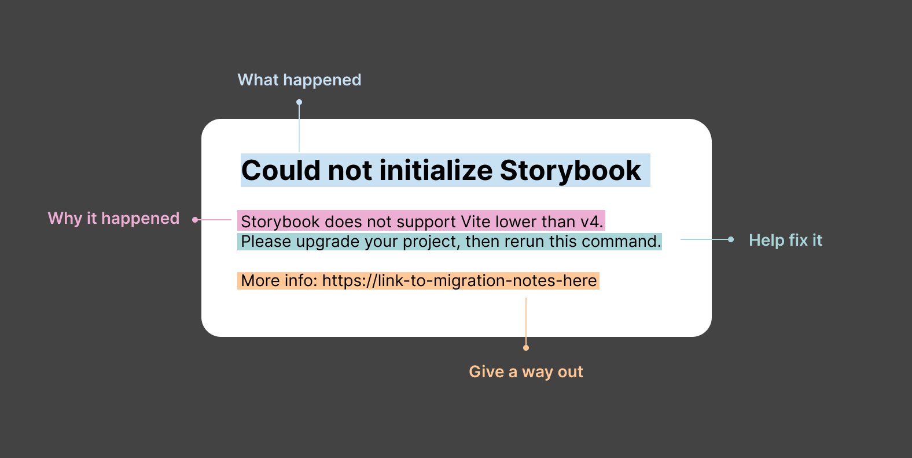

# Storybook Errors

Storybook provides a utility to manage errors thrown from it. Each error is categorized and coded, and there is an ESLint plugin which enforces their usage, instead of throwing generic errors like `throw new Error()`.

Storybook errors reside in this package and are categorized into:

1. **[Preview errors](./preview-errors.ts)**
   - Errors which occur in the preview part of Storybook (where user code executes)
   - e.g. Rendering issues, etc.
   - available in `@storybook/core-events/preview-errors`
2. **[Manager errors](./manager-errors.ts)**
   - Errors which occur in the manager part of Storybook (manager UI)
   - e.g. Sidebar, addons, Storybook UI, Storybook router, etc.
   - available in `@storybook/core-events/server-errors`
3. **[Server errors](./server-errors.ts)**
   - Errors which occur in node
   - e.g. Storybook init command, dev command, builder errors (Webpack, Vite), etc.
   - available in `@storybook/core-events/server-errors`

## How to create errors

First, **find which file your error should be part of**, based on the criteria above.
Second use the `StorybookError` class to define custom errors with specific codes and categories for use within the Storybook codebase. Below is a detailed documentation for the error properties:

### Class Structure

```typescript
import { StorybookError } from './storybook-error';
export class YourCustomError extends StorybookError {
  readonly category: Category; // The category to which the error belongs. Check the source in client-errors.ts or server-errors.ts for reference.
  readonly code: number; // The numeric code for the error.

  template(): string {
    // A function that returns the error message.
  }
}
```

### Properties

| Name          | Type                  | Description                                                                                                                                                |
| ------------- | --------------------- | ---------------------------------------------------------------------------------------------------------------------------------------------------------- |
| category      | `Category`            | The category to which the error belongs.                                                                                                                   |
| code          | `number`              | The numeric code for the error.                                                                                                                            |
| template      | `() => string`        | Function that returns a properly written error message.                                                                                                    |
| data          | `Object`              | Optional. Data associated with the error. Used to provide additional information in the error message or to be passed to telemetry.                        |
| documentation | `boolean` or `string` | Optional. Should be set to `true` **if the error is documented on the Storybook website**. If defined as string, it should be a custom documentation link. |

## Usage Example

```typescript
// Define a custom error with a numeric code and a static error message template.
export class StorybookIndexGenerationError extends StorybookError {
  category = Category.Generic;
  code = 1;

  template(): string {
    return `Storybook failed when generating an index for your stories. Check the stories field in your main.js`;
  }
}

// Define a custom error with a numeric code and a dynamic error message template based on properties from the constructor.
export class InvalidFileExtensionError extends StorybookError {
  category = Category.Validation;
  code = 2;
  documentation = 'https://some-custom-documentation.com/validation-errors';

  // extra properties are defined in the constructor via a data property, which is available in any class method
  // always use this data Object notation!
  constructor(public data: { extension: string }) {
    super();
  }

  template(): string {
    return `Invalid file extension found: ${this.data.extension}.`;
  }
}

// import the errors where you need them, i.e.
import {
  StorybookIndexGenerationError,
  InvalidFileExtensionError,
} from '@storybook/core-events/server-errors';

throw StorybookIndexGenerationError();
// "SB_Generic_0001: Storybook failed when generating an index for your stories. Check the stories field in your main.js.

throw InvalidFileExtensionError({ extension: 'mtsx' });
// "SB_Validation_0002: Invalid file extension found: mtsx. More info: https://some-custom-documentation.com/validation-errors"
```

## How to write a proper error message

Writing clear and informative error messages is crucial for effective debugging and troubleshooting. A well-crafted error message can save developers and users valuable time. Consider the following guidelines:

- **Be clear and specific:** Provide straightforward error messages that precisely describe the issue.
- **Include relevant context:** Add details about the error's origin and relevant context to aid troubleshooting.
- **Provide guidance for resolution:** Offer actionable steps to resolve the error or suggest potential fixes.
- **Provide documentation links:** Whenever applicable, provide links for users to get guidance or more context to fix their issues.



✅ Here are a few recommended examples:

Long:

```
Couldn't find story matching id 'component--button-primary' after HMR.
  - Did you just rename a story?
  - Did you remove it from your CSF file?
  - Are you sure a story with the id 'component--button-primary' exists?
  - Please check the values in the stories field of your main.js config and see if they would match your CSF File.
  - Also check the browser console and terminal for potential error messages.
```

Medium:

```
Addon-docs no longer uses configureJsx or mdxBabelOptions in 7.0.

To update your configuration, please see migration instructions here:

https://github.com/storybookjs/storybook/blob/next/MIGRATION.md#dropped-addon-docs-manual-babel-configuration
```

Short:

```
Failed to start Storybook.

Do you have an error in your \`preview.js\`? Check your Storybook's browser console for errors.
```

❌ Here are a few unrecommended examples:

```
outputDir is required
```

```
Cannot render story
```

```
no builder configured!
```

## What's the motivation for this errors framework?

Centralizing and categorizing errors offers several advantages:

Better understanding of what is actually failing: By defining categories, error origins become more evident, easing the debugging process for developers and providing users with actionable insights.

Improved Telemetry: Aggregating and filtering errors allows better assessment of their impact, which helps in prioritization and tackling the issues.

Improved Documentation: Categorized errors lead to the creation of a helpful errors page on the Storybook website, benefiting users with better guidance and improving overall accessibility and user experience.
